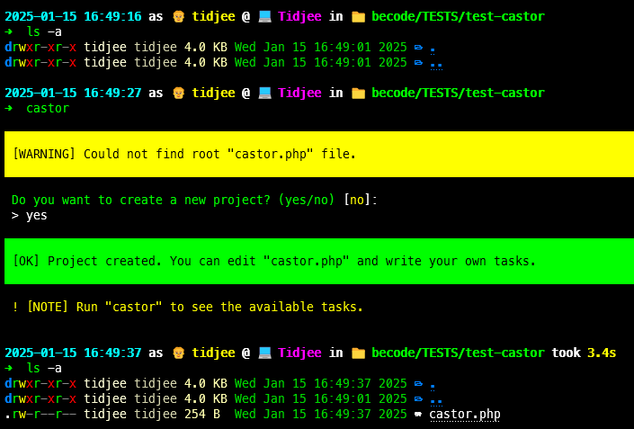
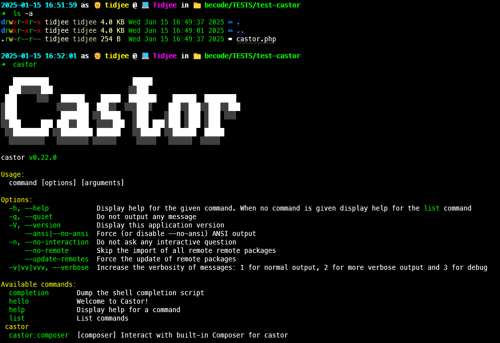

# Tech Talk 3 : Les `task runners`

## Qu'est-ce qu'un `task runner` ?

Un **task runner** est un outil qui automatise les **tâches répétitives** dans le processus de développement, telles que la compilation du code, l'exécution des tests ou le déploiement des applications.

Ils améliorent l'efficacité, réduisent les erreurs humaines et assurent une cohérence dans les projets.

## Présentation des `Castor`

**Castor** est un task runner orienté expérience développeur (DX) construit en **PHP**. Il se positionne comme une alternative à des outils tels que Makefile, en tirant parti des capacités de script de PHP et de son vaste écosystème de bibliothèques.

### Caractéristiques principales

- Analyse transparente des arguments et options : Simplifie la gestion des entrées.

- Support de l'autocomplétion : Facilite une saisie plus rapide et sans erreur.

Il offre entre autres fonctionnalités :

- **`io()`**

  - Affiche des sorties élégantes et interagit avec le terminal.
    `io()` se base sur le composant [`console` de Symfony](https://symfony.com/doc/current/console.html).

- **`run()`**

  - Exécute des processus externes, permettant une intégration transparente avec des outils externes.

- **`fs()`**

  - Crée, supprime et manipule des fichiers et des répertoires.

- **`open()`**

  - Ouvre des fichiers et des répertoires.

## Comparaison entre `Makefile` et `Castor`

| **Caractéristique**        | **Makefile**                                                    | **Castor**                                                  |
| -------------------------- | --------------------------------------------------------------- | ----------------------------------------------------------- |
| **Langage**                | Utilise sa propre syntaxe spécifique, parfois complexe.         | Écrit en PHP, syntaxe familière aux développeurs PHP.       |
| **Utilisation**            | Principalement pour la compilation et l’automatisation basique. | Conçu pour des tâches d’automatisation variées et avancées. |
| **Compatibilité**          | Fonctionne sur Linux/MacOS, avec des limitations sous Windows.  | Compatible avec tout environnement supportant PHP.          |
| **Extensibilité**          | Extensible via scripts externes.                                | Extensible grâce à l’écosystème PHP et ses bibliothèques.   |
| **Courbe d'apprentissage** | Raide à cause de la syntaxe spécifique.                         | Plus accessible pour les développeurs PHP.                  |

## Installation de `Castor`

- Linux, MacOS & WSL

  - Avec l'installer (PHP est requis)

    ```bash
    curl "https://castor.jolicode.com/install" | bash
    ```

## `castor completion`

- Ajoute la ligne suivante au fichier `.bashrc` ou `.zshrc`

  - `.bashrc`

    ```bash
    eval "$(/usr/local/bin/castor completion bash)"
    ```

  - `.zshrc`

    ```bash
    eval "$(/usr/local/bin/castor completion zsh)"
    ```

## Utilisation

```bash
cd /path/to/project
castor
```

- Initialisation de Castor

  

- Utilisation de Castor

  

## Syntaxe de `Castor`

## Exemples

## Démo
